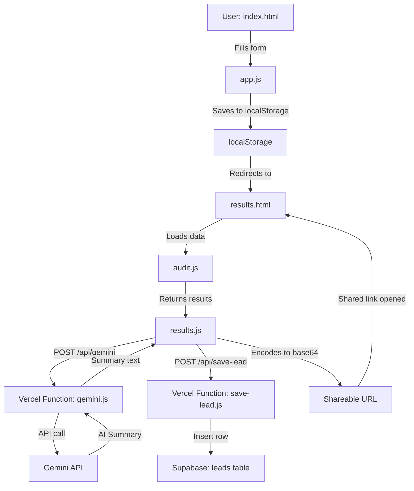

# Architecture

## System Diagram

## Data Flow

1. **User fills form** on `index.html`
   - Tool names, plans, seats, monthly spend
   - Team size and primary use case

2. **`app.js` collects form data**
   - Validates inputs
   - Saves to `localStorage` as JSON
   - Clears previous AI summary cache
   - Redirects to `results.html`

3. **`results.html` loads**
   - Checks URL for `?audit=` parameter
   - If found → shared view (load from URL)
   - If not → load from localStorage

4. **`audit.js` runs the engine**
   - Per-tool rules evaluate plan fit
   - Calculates monthly and annual savings
   - Returns results array + totals

5. **`results.js` renders output**
   - Displays per-tool breakdown
   - Shows hero savings number
   - Calls `/api/gemini` for AI summary
   - Generates shareable base64 URL

6. **`/api/gemini` Vercel Function**
   - Receives prompt from client
   - Calls Gemini API server-side
   - Returns summary text
   - Keys never exposed to browser

7. **`/api/save-lead` Vercel Function**
   - Receives email + audit data
   - Inserts into Supabase leads table
   - Keys never exposed to browser

## Why I Chose This Stack

**Vanilla JS**
The audit engine is pure deterministic logic —
if/else rules, arithmetic, string formatting.
No reactive state, no component tree, no build step.
A framework would add 50KB+ of overhead and a 
local dev server requirement for a tool that is 
essentially a smart form + results page.
Vanilla JS ships faster and is easier to debug.

**Supabase**
- Free tier is generous (500MB, unlimited API calls)
- Built-in Row Level Security
- REST API works directly from Vercel Functions
- SQL editor made table setup and debugging easy
- No ORM needed for a single-table use case

**Vercel**
- Zero-config deployment from GitHub
- Serverless Functions in `/api` folder —
  no separate backend server needed
- Free tier covers this project completely
- Automatic HTTPS and CDN

**Gemini API**
- Free tier: 1500 requests/day, no card required
- gemini-2.0-flash-lite is fast and cheap
- Sufficient quality for 80-100 word summaries

## What I Would Change for 10,000 Audits/Day

1. **Database reads for shareable URLs**
   Currently audit data is base64 encoded in the URL.
   At scale, URLs become very long and hard to share.
   Switch to: store audit in Supabase, return a 
   short ID, use that as the share URL.
   Example: credex.rocks/audit/abc123

2. **Rate limiting on API routes**
   Currently no rate limiting on /api/gemini or 
   /api/save-lead. At scale, add Redis-based rate 
   limiting (Upstash) — max 5 requests/IP/hour.

3. **Caching AI summaries in database**
   Same audit inputs → same summary. Cache in 
   Supabase to avoid redundant Gemini API calls.
   At 10k audits/day, Gemini free tier would be 
   exhausted immediately — need paid tier or cache.

4. **CDN for static assets**
   Move CSS/JS to a CDN (Cloudflare R2) for 
   faster global load times.

5. **Queue for email delivery**
   Resend email delivery should be async via a 
   queue (Inngest or Trigger.dev) — not blocking 
   the API response.